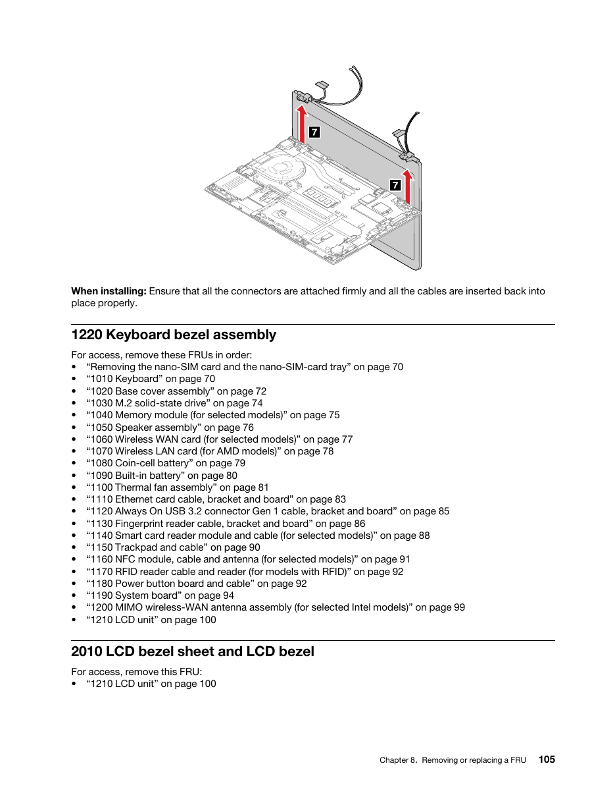
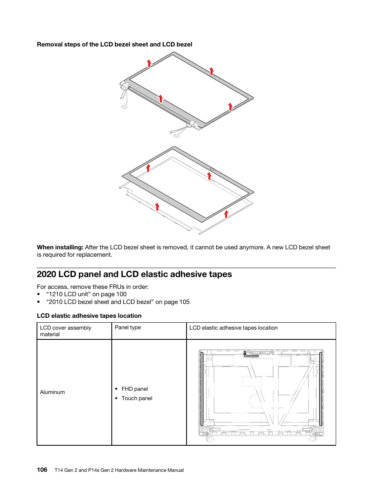

A step-by-step guide for finding why the internal panel of my ThinkPad T14 Gen 2a
(20XLS0CK00, AMD) went dark after I reopened the case. The page exists so I can
read it on my phone while the laptop is in pieces. The figures are from the
Lenovo Hardware Maintenance Manual (HMM) for the T14 Gen 2 and P14s Gen 2;
page numbers are the printed ones.

## What is already known

- The panel shows a faint desktop under a torch. The panel logic and the eDP
  data lanes work.
- The eDP link trained at 4 lanes, HBR2. `psr_state` is 0.
- The GPU commands the backlight at 99 % (`amdgpu_current_backlight_pwm`
  0xfb18, target equal).
- The lid switch reads open and the camera works, so the camera/Hall sensor/LED
  cable is fine.
- Reseating and cleaning the LCD cable at the system board did not help.

So the break is in the backlight supply path. Three candidates remain, in order
of likelihood: the LCD cable, the backlight fuse on the system board, the LED
driver on the panel. A multimeter separates them.

Panel from the EDID: CSOT `MNE001EA1-5`, 14" FHD, standard 30-pin eDP.

## The two connectors at the hinges

The figure is a bottom view, so left and right are mirrored against normal use.

| Connector in the figure                             | Cable                        | Hinge in normal use | Matters here |
| --------------------------------------------------- | ---------------------------- | ------------------- | ------------ |
| Wide, beside the WLAN card and the USB-C/HDMI ports | LCD cable (eDP + backlight)  | Left, port side     | Yes          |
| Narrow, beside the fan                              | Camera/Hall sensor/LED cable | Right, exhaust side | No           |

Both have a fold-up metal bar latch: lift the bar, pull the cable straight out,
push it back flat, fold the bar down.

## 30-pin panel connector pinout

Pin 1 is marked with a "1" or a triangle on the panel PCB. Count from there.

| Pins       | Signal  | Expected with the machine on                |
| ---------- | ------- | ------------------------------------------- |
| 12, 13     | LCD_VCC | about 3.3 V (sanity check, must be present) |
| 19 to 22   | BL_GND  | 0 V, meter ground                           |
| 25         | BL_EN   | about 3.3 V                                 |
| 26         | BL_PWM  | 0 to 3.3 V, changes with brightness         |
| 28, 29, 30 | BL_VCC  | steady DC, typically 7 to 21 V              |

The three BL_VCC pins are usually joined by one wider copper trace on the panel
PCB. The four BL_GND pins are also joined.

## Battery rule

The battery must be disabled for every unplug, plug, or continuity check. It
must be enabled, with the machine running, for every voltage check. Disabling is
done in the BIOS, and plugging in the AC adapter re-enables it. The phases below
alternate between the two.

To disable: power on, press F1 at the logo (on the HDMI monitor), Config, Power,
Disable Built-in Battery, Yes. The machine turns off. Then unplug the AC adapter.

## Phase 0, prepare

1. Meter on DC volts, 20 V range, for voltage. Beep or diode symbol for
   continuity.
2. Tape a sewing needle to each probe tip. The pins are 0.5 mm apart.
3. Shut the machine down.

## Phase 1, open, battery disabled

4. Disable the battery (see above). Unplug the AC adapter.
5. Remove the base cover (HMM 1020, 5 captive screws, pry from the rear edge).
6. Remove the bezel. Lift at the four arrows. The bezel sheet is single use.

7. Pull the three stretch tapes slowly (step 1). Lift the panel out (step 2) and
   turn it face down onto a cloth on the keyboard (step 3). Leave the LCD cable
   connected at both ends.

8. On the back of the panel, find the 30-pin connector on the panel PCB and its
   pin 1 mark.

## Phase 2, voltage, machine on

9. Plug in the AC adapter. This re-enables the battery. Power on and boot to the
   desktop on the HDMI monitor. Press Fn+F6 until the brightness is at maximum.
10. Black needle on a pin 19 to 22 solder tail. Hold it there for every reading.
11. Sanity check: red needle on pin 12 or 13. Expect about 3.3 V. No reading
    means wrong pins or wrong end. Fix that before going on.
12. Red needle on pin 28, then 29, then 30. Write down each.
13. Red needle on pin 25, then 26. Write down each.
14. Read the result:
    - 28 to 30 show 7 to 21 V and 25 shows about 3.3 V: the panel's LED driver
      is dead. Replace the panel. Stop.
    - 28 to 30 show 0 V: the power line does not reach the panel. Phase 3.
    - 28 to 30 show voltage, 25 shows 0 V: the enable line does not reach the
      panel. Phase 3, test pin 25 in particular.
15. Shut down. Do not let the probes touch anything else while the machine is
    on. A slip across two pins can damage the panel.

## Phase 3, cable continuity, battery disabled

16. Disable the battery. Unplug the AC adapter.
17. Unplug the cable at the panel: peel the tape, lift the latch, pull straight
    out (steps 4 to 6). Unplug it at the board: lift the bar latch, pull
    straight out.

18. Meter on continuity. One needle on pin 28 at the panel-end plug. Sweep the
    other needle across every pin of the board-end plug until it beeps. Note
    which pin. Repeat for 29, 30 and 25. The board end is Lenovo's own pinout,
    so finding the mate by sweeping is the method.
19. Short check: needle on pin 28 at the panel-end plug, other needle on pin 19
    at the same plug. It must not beep.
20. Read the result:
    - A pin from step 18 beeps nowhere: the cable is open. Replace the cable.
      Stop.
    - Step 19 beeps: the cable is shorted. That also explains a blown fuse.
      Replace the cable and do phase 4.
    - All beep correctly, no short: the cable is good. Phase 4.

Cable route inside the lid, for the visual check along the left hinge:

## Phase 4, fuse and board

21. Still off, battery disabled. On the board next to the LCD connector, find
    the small rectangular part marked F and a number on the silkscreen.
    Continuity across its two ends.
    - No beep: the fuse is blown. Solder replacement on the board. Stop.
    - Beeps: the fuse is fine. Step 22.
22. Plug the cable back in at both ends. Plug in the AC adapter, power on to the
    desktop, brightness to maximum.
23. On the board-side connector, measure the solder tail of the pin that mated
    with panel pin 28 in step 18, against any ground.
    - 0 V: the board does not switch the backlight power on. Board-level fault.
    - Voltage present: the reseat in step 22 fixed the cable contact, or the
      panel fails intermittently. Check whether the panel is lit.

Caveat: some boards only switch the backlight rail on when a panel is detected.
A 0 V reading at the board end with the cable unplugged means nothing. Always
measure voltage with the cable connected at both ends.

## Phase 5, close

24. Shut down. Disable the battery before you plug and route the cable.
25. Fit the panel with thin double-sided tissue tape (0.1 to 0.25 mm, 2 to 3 mm
    wide, the phone repair kind, not foam) at the same places as the original
    stretch tapes: both short sides and the short strip at the top. Short
    strips at the corners are enough while the panel may still come out again.
26. Clip the bezel on. Fit the base cover. Plug in the AC adapter.

## Shopping list, Saara

- Thin double-sided tissue tape: "fita dupla face fina de tecido para tela de
  celular", 2 to 3 mm wide. Reference: 3M 9448 or 300LSE. Not "espuma", not VHB.
- Digital multimeter, DT-830 type.
- Two sewing needles for the probe tips.

## Video: the same fault on a Lenovo E14

South London Repair, "Lenovo E14 Display Repair No Backlight Engineer mistake,
sparks". A no-backlight case on a related Lenovo, with the board-side probing
shown on camera.

<iframe class="aspect-video" title="Lenovo E14 Display Repair No Backlight Engineer mistake, sparks | South London Repair" width="945" height="531" src="https://www.youtube.com/embed/I5T9uOPX6kQ?rel=0" allowfullscreen></iframe>

Link: [youtube.com/watch?v=I5T9uOPX6kQ](https://www.youtube.com/watch?v=I5T9uOPX6kQ)

## Sources

- Lenovo, T14 Gen 2 and P14s Gen 2 Hardware Maintenance Manual, printed pages
  39 (error 0288), 41 (LCD symptoms), 103, 105 to 109, 122.
- The full investigation log lives in my private `t14` repository,
  `debugging.md`, appendix A15.
