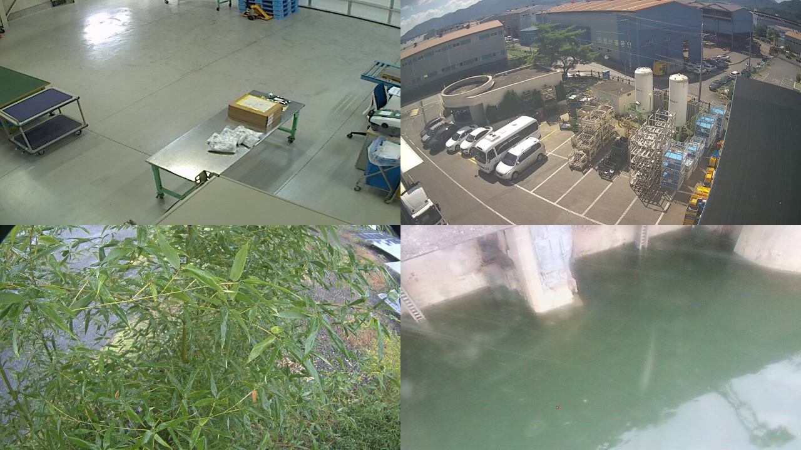
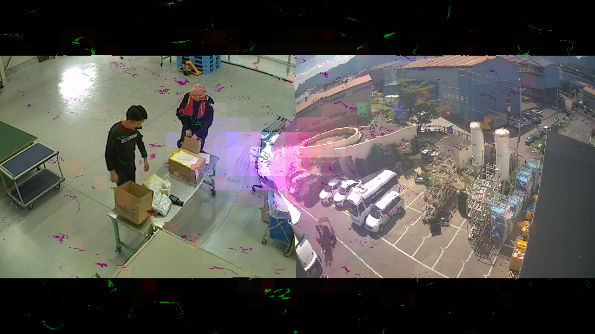
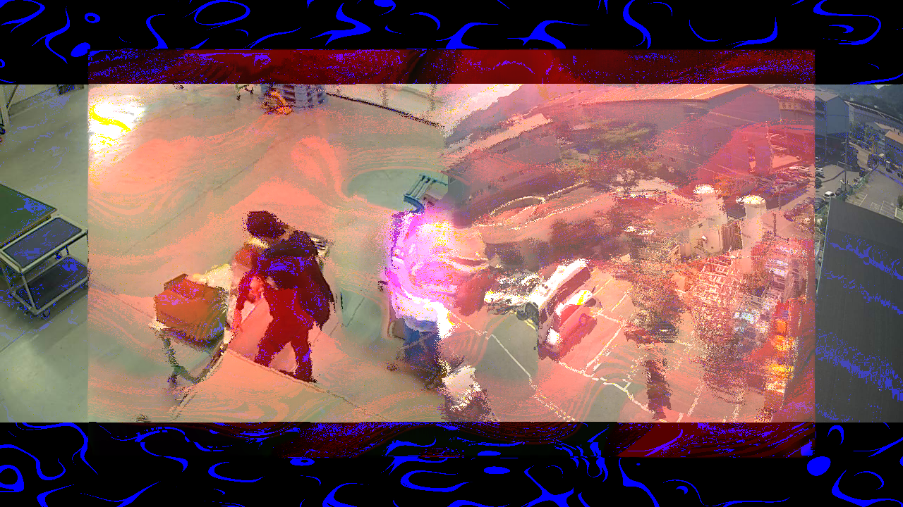
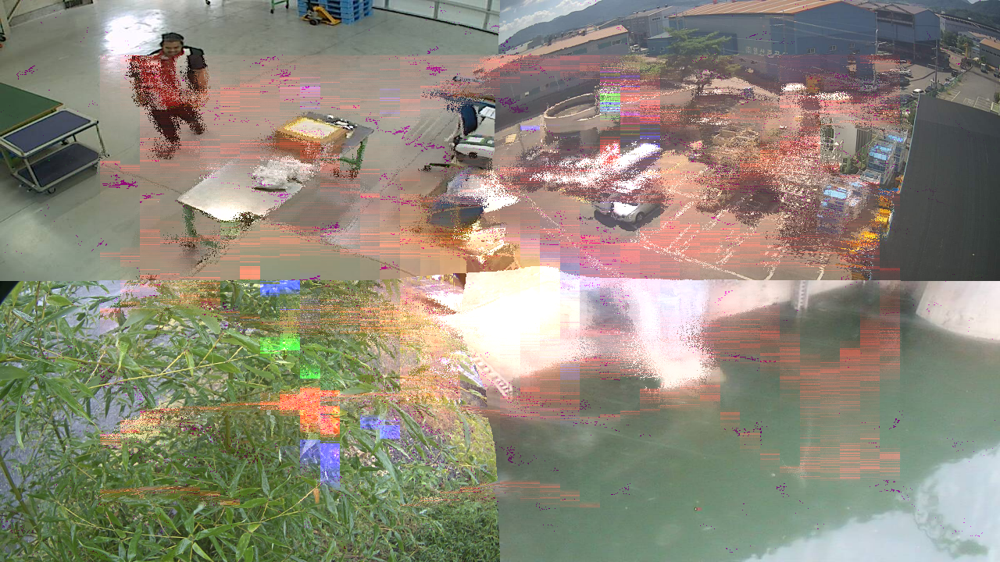
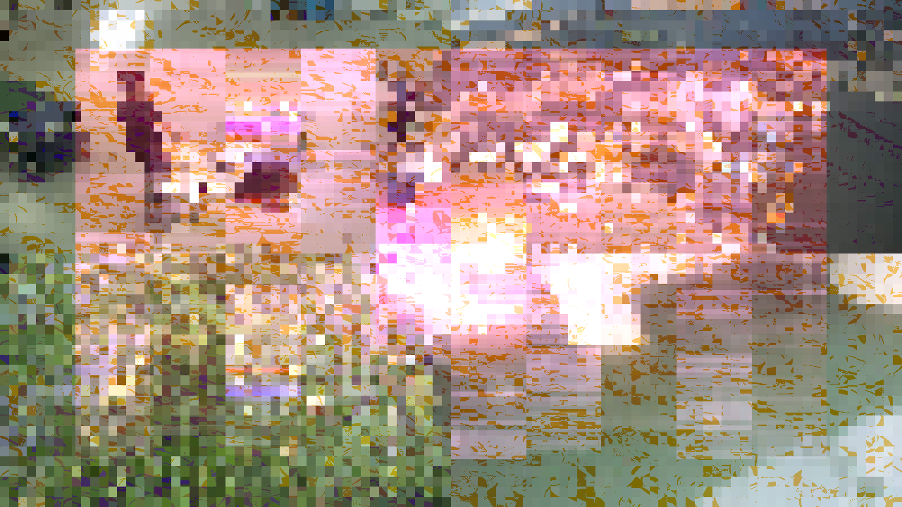
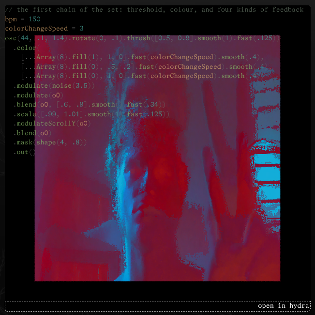
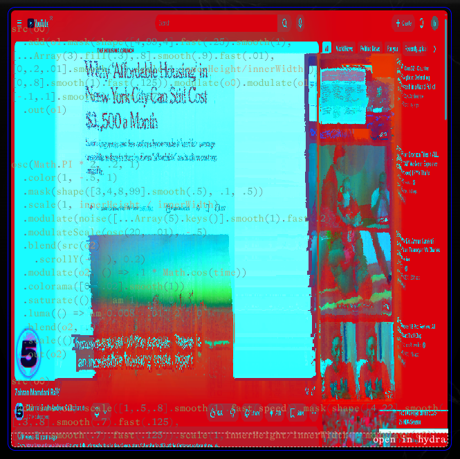

This page documents the set I play on 16 September 2026 in Rio de Janeiro. It
holds the text I wrote for the night, the code that makes the image, and
screenshots of the same code running on public cameras. The code blocks below
run in this page. Click one if it does not start on its own.

## The set

This set is a live-coded visual system written in Hydra. It grew out of a
collaboration with regula.rec, the Zurich based friend-group and music label,
and it has changed shape over years of playing together, from a first version
at Rote Fabrik in Switzerland in 2022 to the one running tonight.

Nothing here is pre-rendered. The image is built from a small number of
oscillators and shapes that feed back into themselves through four buffers, so
every frame is made from the frames before it. The result does not settle:
color cycles through hard thresholds, forms fold through noise and voronoi
fields, and the whole picture pixelates and reassembles as it runs.

The system listens where it can. When there is sound in the room, a frequency
analysis of it drives the scale, repetition, and brightness of the visuals, and
a beat detector ties the motion to the rhythm. Left in silence, the piece still
breathes and changes on its own, moving on its internal clock. Sound pushes it
further, but it never stops.

Because the piece is live and ever-changing code, it is never the same twice. It
is closer to an instrument than to a video: a machine for images that is
played, in the room, for the length of the day.

## The cameras

Some of what you see is not synthetic. The two cameras in the store, the one on
the front of the shop and the security camera, feed their pictures straight
into the system, and everything above folds those live views back on
themselves.

This is the part worth watching. A camera is usually a tool of security: it
looks so that someone else can check later. Here the same feeds are pulled into
the room and turned into something to look at now, for the people in front of
them. The street, the door, whoever walks in, all of it becomes material, bent
through feedback and colour until it is barely itself, then surfaces again for a
moment before it folds away.

Earlier versions of this set were fed by stranger eyes: live cameras inside
chicken coops, surveillance footage from power plants, underwater feeds from
ocean expeditions, and more, all of them public streams left running somewhere
in the world. The idea is simple. The cameras are already on and already
watching. This set borrows a few of them and gives their gaze back to the room
as light. Artists have worked this ground for years, from Xu Bing, who built a
whole film out of found surveillance footage, to Manu Luksch, who wrote a
manifesto for making films only from public cameras. Nothing here is recorded
and nothing leaves the room. The processing is live and local, and it ends when
the night ends.

## Public cameras through the set

The pictures below are the set running on cameras I do not own. The feeds come
from [insecam](http://www.insecam.org), a directory of surveillance cameras that
answer to anyone on the open internet. I picked feeds that were awake, which at
this hour meant the other side of the world: a workshop floor, an industrial
yard, bamboo over a stream, a canal wall.

This is the first picture, before any processing. Four cameras, four places, one
screen. The set reads this screen as a single source.



Two cameras is the arrangement of the night, one inside and one outside. The
same shape as the shop front and the security camera.



The feedback keeps a memory of the frames before it, so the colour drifts away
from the camera and the camera keeps pulling it back.



With four feeds the screen becomes a grid, and the set treats the seams between
the cameras as edges to work with.



The last stage pixelates the whole picture and puts it back together. The places
are still in there, a few blocks wide.



The cameras are named here by what they show and where they are, not by
address. Anyone can find them the way I did, but this page will not carry the
door number.

## Me through the visual

Photographs to come: I stand in front of the projection and take myself through
the image, the way the streets will be taken through it on the night.



The next one you can make yourself. The first code block below asks for your
camera and puts you where the shop cameras go.

## Running it on the night

You need the computer, the projector, and both cameras: the one on the front of
the shop and the security camera. Here is the setup, step by step.

1. **What Hydra is.** Hydra is a tool for making video live in a web browser.
   You write short lines of code, and each line adds a video source or an effect
   on top of the last. There is no file to render and no timeline. The picture is
   built and changed while it runs. You do not need to understand the code to
   start it.

2. **Open the sketch.** On the computer, open [the sketch link](https://hydra.ojack.xyz/?code=YnBtJTNEMTUwJTBBc3BlZWQlM0QuNSUwQWJlYXRzJTIwJTNEJTIwMCUwQWEuc2hvdygpJTBBbnVtQmlucyUzRDQlMEFhLnNldEJpbnMobnVtQmlucyUyQjEpJTBBJTJGJTJGJTIwYS5zZXRDdXRvZmYoLjIpJTBBJTJGJTJGJTIwYS5zZXRTY2FsZSgyKSUwQWEuc2V0U21vb3RoKDApJTBBYS5vbkJlYXQlMjAlM0QlMjAoKSUyMCUzRCUzRSUyMCU3QmJlYXRzJTJCJTJCJTdEJTBBJTBBYW0lMjAlM0QlMjAoYyUyMCUzRCUyMDAuMDElMkMlMjB2JTIwJTNEJTIwMC4xJTJDJTIwaSUyMCUzRCUyMDApJTIwJTNEJTNFJTIwYyUyMCUyQiUyMHYlMjAqJTIwYS5mZnQlNUJpJTVEJTBBJTBBczAuaW5pdFNjcmVlbigyJTIwKSUwQXJlbmRlcigpJTBBJTBBbSUzRHNoYXBlKDQlMkMuNCUyQy4zKS5zY2FsZSguNSUyQzEpLnNjcm9sbFkoLjIpLmludmVydCgpJTJDJTVCLjMlMkMuOCU1RC5zbW9vdGgoKSUwQXdhbGslMjAlM0QlMjAlNUIuLi5BcnJheSgxMCkua2V5cygpJTVELm1hcChlJTNEJTNFZSouMDEpLmZhc3QoMC4xKS5zbW9vdGgoMSklMEElMEFjb2xvckNoYW5nZVNwZWVkJTIwJTNEJTIwMSUwQSUwQSUwQW9zYyg0NCUyQy4xJTJDMS40KS5yb3RhdGUoMCUyQy4xKS50aHJlc2goJTVCMC41JTJDMC45JTVELnNtb290aCgxKS5mYXN0KC4xMjUpKSUwQSUyMCUyMC5jb2xvciglMEElMjAlMjAlMjAlMjAlNUIuLi5BcnJheSg4KS5maWxsKDEpJTJDMSUyQzAlNUQuZmFzdChjb2xvckNoYW5nZVNwZWVkKS5zbW9vdGgoLjQpJTJDJTBBJTIwJTIwJTIwJTIwJTVCLi4uQXJyYXkoOCkuZmlsbCgwKSUyQy41JTJDLjIlNUQuZmFzdChjb2xvckNoYW5nZVNwZWVkKS5zbW9vdGgoLjQpJTJDJTBBJTIwJTIwJTIwJTIwJTVCLi4uQXJyYXkoOCkuZmlsbCgwKSUyQzElMkMwJTVELmZhc3QoY29sb3JDaGFuZ2VTcGVlZCkuc21vb3RoKC40KSklMEElMjAlMjAubW9kdWxhdGUobm9pc2UoMy41KSkubW9kdWxhdGUobzApLmJsZW5kKG8wJTJDJTVCLjYlMkMuOSU1RC5zbW9vdGgoKS5mYXN0KC4zNCkpLnNjYWxlKCU1Qi45OSUyQzEuMDElNUQuc21vb3RoKDEpLmZhc3QoLjEyNSkpLm1vZHVsYXRlU2Nyb2xsWShvMCkuYmxlbmQobzApLm1hc2soc2hhcGUoNCUyQy44KSklMEElMjAlMjAlMkYlMkYubXVsdChtKSUwQSUyMCUyMC5vdXQoKSUwQSUwQW9sJTNEb3NjKCU1QjExJTJDMjIlNUQuc21vb3RoKC45KS5mYXN0KC4wMSklMkMuMDElMkMxLjQpLm1vZHVsYXRlKHZvcm9ub2koKCklM0QlM0VNYXRoLnJvdW5kKGFtKDIlMkMuNSUyQzApKSklMkMuMikuY29udHJhc3QoJTVCLjUlMkMxJTVELnNtb290aCgxKS5mYXN0KC4wMykpJTBBb2wxJTNEc3JjKG8xKS5tb2R1bGF0ZVJvdGF0ZShvMSUyQy41KSUwQSUyMCUyMCUyMCUyMCUyMCUyMC5hZGQob3NjKE1hdGguUEkqOCUyQy4xJTJDMS41KSUyQy4wNSklMEElMjAlMjAlMjAlMjAubXVsdCglMEElMjAlMjAlMjAlMjAlMjAlMjAlMjAlMjAlMjAlMjBzaGFwZSgzJTJDLjclMkMuOSkubHVtYSguMiUyQy4wNSklMEElMjAlMjAlMjAlMjApJTBBJTIwJTIwJTIwJTIwLnNjYWxlKC45KSUwQSUyMCUyMCUyMCUyMC5zYXR1cmF0ZSgxLjA3KSUwQSUyMCUyMCUyMCUyMC5jb250cmFzdCguOTYpJTBBJTIwJTIwJTIwJTIwLmh1ZSgtLjAzKSUwQSUyMCUyMCUyMCUyMC5jb2xvcigxLjA1JTJDMSUyQzEpJTBBJTBBc3JjKG8wKSUwQSUyMCUyMC5hZGQob2wubWFzayhzaGFwZSglNUI0JTJDOTklMkM0JTVELmZhc3QoLjI1KS5zbW9vdGgoMSklMkMlNUIuLi5BcnJheSgzKS5maWxsKC4zKSUyQy44JTVELnNtb290aCguOSkuZmFzdCguMDEpJTJDJTVCMCUyQy4yJTJDLjAxJTVELnNtb290aCgxKSkuc2NhbGUoMSUyQ2lubmVySGVpZ2h0JTJGaW5uZXJXaWR0aCkpJTJDJTVCMCUyQy44JTVELnNtb290aCgxKS5mYXN0KC4xMjUpKS5tb2R1bGF0ZShvMCkubW9kdWxhdGUobzElMkMlNUItLjElMkMuMSU1RC5zbW9vdGgoKS5mYXN0KC42NykpJTBBJTIwJTIwLm91dChvMSklMEElMEElMEElMEFvc2MoTWF0aC5QSSUyMColMjAyJTJDJTIwLjIlMkMlMjAxKSUwQSUyMCUyMC5jb2xvcigxJTJDJTIwLS41JTJDJTIwMSklMEElMjAlMjAubWFzayhzaGFwZSglNUIzJTJDNCUyQzglMkM5OSU1RC5zbW9vdGgoLjUpJTJDJTIwLjElMkMlMjAuNSkpJTBBJTIwJTIwLnNjYWxlKDElMkMlMjBpbm5lckhlaWdodCUyMCUyRiUyMGlubmVyV2lkdGgpJTBBJTIwJTIwLm1vZHVsYXRlKG5vaXNlKCU1Qi4uLkFycmF5KDUpLmtleXMoKSU1RC5zbW9vdGgoMSkuZmFzdCguMikpKSUwQSUyMCUyMC5tb2R1bGF0ZVNjYWxlKG9zYygyMCUyQyUyMC4wMSklMkMlMjAtLjUpJTBBJTIwJTIwLmJsZW5kKHNyYyhvMiklMEElMjAlMjAlMjAlMjAuc2Nyb2xsWSgtMC4xKSUyQyUyMDAuMiklMEElMjAlMjAubW9kdWxhdGUobzIlMkMlMjAoKSUyMCUzRCUzRSUyMC4xJTIwKiUyME1hdGguY29zKHRpbWUpKSUwQSUyMCUyMC5jb2xvcmFtYSglNUIwJTJDJTIwLjAyJTVELnNtb290aCgxKSklMEElMjAlMjAuc2F0dXJhdGUoKCklMjAlM0QlM0UlMjBhbSgxJTJDJTIwLjIlMkMlMjAwKSklMEElMjAlMjAubHVtYSgoKSUyMCUzRCUzRSUyMGFtKDAuMDA4JTJDJTIwLjAxJTJDJTIwMiklMkMlMjAwKSUwQSUyMCUyMC5ibGVuZChvMiUyQyUyMC45KSUwQSUyMCUyMC5zY2FsZSgoKSUyMCUzRCUzRSUyMGFtKDEuMDElMkMlMjAtLjAyJTJDJTIwMikpJTBBJTIwJTIwLm91dChvMiklMEElMEFzcmMobzApJTBBJTIwJTIwLmFkZChzcmMobzIpLnNjYWxlKCU1QjElMkMuNSUyQy44JTVELnNtb290aCgxKS5mYXN0KHNwZWVkKSkubWFzayhzaGFwZSglNUI0JTJDMjIlNUQuc21vb3RoKC43KS5mYXN0KC4xMjUpJTJDJTVCLjMlMkMuOCU1RC5zbW9vdGgoLjcpLmZhc3QoLjEyNSklMkMlMjAlNUIwJTJDLjIlNUQuc21vb3RoKC43KS5mYXN0KC4xMjUpKS5zY2FsZSgxJTJDaW5uZXJIZWlnaHQlMkZpbm5lcldpZHRoKSkubW9kdWxhdGUobzApKSUwQSUyMCUyMC5vdXQobzEpJTBBJTBBJTBBc3JjKHMwKS5tb2R1bGF0ZShvMSkucGl4ZWxhdGUoJTVCLi4uQXJyYXkoNCkuZmlsbChpbm5lcldpZHRoKSUyQzEwMCU1RC5zbW9vdGgoLjEpJTJDJTVCLi4uQXJyYXkoNCkuZmlsbChpbm5lckhlaWdodCklMkM1MCU1RC5zbW9vdGgoLjAxKSklMEElMjAlMjAuYWRkKHNyYyhvMSkucGl4ZWxhdGUoJTVCLi4uQXJyYXkoNCkuZmlsbChpbm5lcldpZHRoKSUyQzEwMDAlMkM1MDAlMkMxMDAlMkM1MCUyQzEyJTVELnNtb290aCguMSklMkMlNUIuLi5BcnJheSg0KS5maWxsKGlubmVySGVpZ2h0KSUyQzEwMDAlMkM1MDAlMkMxMDAlMkMxMiU1RC5zbW9vdGgoLjgpLmZhc3QoLjI1KSklMkMlNUIxJTJDMiU1RC5zbW9vdGgoKSklMEElMjAlMjAuZGlmZihzaGFwZSgyLjUpLnNjYWxlKCgpJTNEJTNFYW0oMC4yJTJDMC45KSkucm90YXRlKDAlMkMuMSklMEElMjAlMjAucmVwZWF0KCgpJTNEJTNFYW0oNyUyQzMlMkMwKSUyQygpJTNEJTNFYW0oOCUyQzElMkNudW1CaW5zKSUyQygpJTNEJTNFYW0oMSUyQzElMkMwKSUyQygpJTNEJTNFYW0oMSUyQzElMkMyKSklMEElMjAlMjAubW9kdWxhdGUobm9pc2UoKSkubW9kdWxhdGUobzMlMkMoKSUzRCUzRWFtKC4yJTJDMSkpLmNvbG9yKCU1QjElMkMwJTJDMCU1RC5zbW9vdGgoLjEpLmZhc3QoLjAxMjUpJTJDJTVCMCUyQy41JTJDMCU1RC5zbW9vdGgoLjEpLmZhc3QoLjAxMjYpJTJDJTVCMCUyQzAlMkMxJTVELmZhc3QoLjAxMjQpLnNtb290aCguMSkpKSUwQSUyMCUyMC5vdXQobzMpJTBBJTBBcmVuZGVyKG8zKSUwQQ==) in a
   browser (Chrome or Firefox). The full code is already in the link, so it
   loads ready to run. Connect the projector as a second screen and move the
   browser window onto the projector, or mirror the screens.

3. **Show both cameras on one screen.** Hydra reads the cameras as a screen
   input: it copies whatever is on a screen. So both camera pictures must first
   be visible on this computer. Open each camera's web page or app, and place
   the two windows side by side on the same screen so both are in view.

4. **Start the sketch and share that screen.** Click into the code and press the
   play button, or Ctrl+Shift+Enter (Cmd+Shift+Enter on a Mac) to run all of it.
   The browser will ask which screen or window to share. Choose the whole screen
   that shows the two camera windows, and allow it. Both camera pictures now
   flow into the visuals as the source named `s0`.

5. **If it asks for the microphone.** The visuals pick up ambient sound when
   they can, so the browser may ask to use the microphone. Allow it and the
   room's sound will feed the motion. If you skip it or there is no sound, the
   piece still runs and keeps changing on its own.

## The code

### Your camera, where the shop cameras go

This is the last stage of the set with your own camera as the source. The page
has no microphone, so a clock stands in for the sound analysis. Everything the
sound would drive keeps moving.

```javascript
// your camera, where the two shop cameras go
// no microphone on this page, so a clock stands in for the sound analysis
numBins = 4
am = (c = 0.01, v = 0.1, i = 0) => c + v * (0.5 + 0.45 * Math.sin(time * (1.3 + i * 0.37) + i))

s0.initCam()

src(s0)
  .pixelate([...Array(4).fill(innerWidth), 100].smooth(0.1), [...Array(4).fill(innerHeight), 50].smooth(0.01))
  .diff(shape(2.5).scale(() => am(0.2, 0.9)).rotate(0, 0.1)
    .repeat(() => am(7, 3, 0), () => am(8, 1, numBins), () => am(1, 1, 0), () => am(1, 1, 2))
    .modulate(noise())
    .color([1, 0, 0].smooth(0.1).fast(0.0125), [0, 0.5, 0].smooth(0.1).fast(0.0126), [0, 0, 1].fast(0.0124).smooth(0.1)))
  .modulate(o0, () => am(0.005, 0.02))
  .out(o0)
```

### The colour engine

The first chain of the set, on its own. An oscillator goes through a hard
threshold, takes a colour from a list, and then folds back into its own last
frame four times over. No camera, no sound.

```javascript
// the first chain of the set: threshold, colour, and four kinds of feedback
bpm = 150
colorChangeSpeed = 3
osc(44, .1, 1.4).rotate(0, .1).thresh([0.5, 0.9].smooth(1).fast(.125))
  .color(
    [...Array(8).fill(1), 1, 0].fast(colorChangeSpeed).smooth(.4),
    [...Array(8).fill(0), .5, .2].fast(colorChangeSpeed).smooth(.4),
    [...Array(8).fill(0), 1, 0].fast(colorChangeSpeed).smooth(.4))
  .modulate(noise(3.5))
  .modulate(o0)
  .blend(o0, [.6, .9].smooth().fast(.34))
  .scale([.99, 1.01].smooth(1).fast(.125))
  .modulateScrollY(o0)
  .blend(o0)
  .mask(shape(4, .8))
  .out()
```

### All four buffers, with your camera

The whole set, with your camera where the screen capture goes and the clock
where the microphone goes. This is the picture from the screenshots above, made
of whatever your camera can see.

```javascript
// the whole set: four buffers, your camera as s0, a clock instead of the microphone
speed = .5
numBins = 4
colorChangeSpeed = 1
am = (c = 0.01, v = 0.1, i = 0) => c + v * (0.5 + 0.45 * Math.sin(time * (1.3 + i * 0.37) + i))

s0.initCam()

osc(44, .1, 1.4).rotate(0, .1).thresh([0.5, 0.9].smooth(1).fast(.125))
  .color(
    [...Array(8).fill(1), 1, 0].fast(colorChangeSpeed).smooth(.4),
    [...Array(8).fill(0), .5, .2].fast(colorChangeSpeed).smooth(.4),
    [...Array(8).fill(0), 1, 0].fast(colorChangeSpeed).smooth(.4))
  .modulate(noise(3.5)).modulate(o0).blend(o0, [.6, .9].smooth().fast(.34)).scale([.99, 1.01].smooth(1).fast(.125)).modulateScrollY(o0).blend(o0).mask(shape(4, .8))
  .out()

ol = osc([11, 22].smooth(.9).fast(.01), .01, 1.4).modulate(voronoi(() => Math.round(am(2, .5, 0))), .2).contrast([.5, 1].smooth(1).fast(.03))

src(o0)
  .add(ol.mask(shape([4, 99, 4].fast(.25).smooth(1), [...Array(3).fill(.3), .8].smooth(.9).fast(.01), [0, .2, .01].smooth(1)).scale(1, innerHeight / innerWidth)), [0, .8].smooth(1).fast(.125)).modulate(o0).modulate(o1, [-.1, .1].smooth().fast(.67))
  .out(o1)

osc(Math.PI * 2, .2, 1)
  .color(1, -.5, 1)
  .mask(shape([3, 4, 8, 99].smooth(.5), .1, .5))
  .scale(1, innerHeight / innerWidth)
  .modulate(noise([...Array(5).keys()].smooth(1).fast(.2)))
  .modulateScale(osc(20, .01), -.5)
  .blend(src(o2).scrollY(-0.1), 0.2)
  .modulate(o2, () => .1 * Math.cos(time))
  .colorama([0, .02].smooth(1))
  .saturate(() => am(1, .2, 0))
  .luma(() => am(0.008, .01, 2), 0)
  .blend(o2, .9)
  .scale(() => am(1.01, -.02, 2))
  .out(o2)

src(o0)
  .add(src(o2).scale([1, .5, .8].smooth(1).fast(speed)).mask(shape([4, 22].smooth(.7).fast(.125), [.3, .8].smooth(.7).fast(.125), [0, .2].smooth(.7).fast(.125)).scale(1, innerHeight / innerWidth)).modulate(o0))
  .out(o1)

src(s0).modulate(o1).pixelate([...Array(4).fill(innerWidth), 100].smooth(.1), [...Array(4).fill(innerHeight), 50].smooth(.01))
  .add(src(o1).pixelate([...Array(4).fill(innerWidth), 1000, 500, 100, 50, 12].smooth(.1), [...Array(4).fill(innerHeight), 1000, 500, 100, 12].smooth(.8).fast(.25)), [1, 2].smooth())
  .diff(shape(2.5).scale(() => am(0.2, 0.9)).rotate(0, .1)
    .repeat(() => am(7, 3, 0), () => am(8, 1, numBins), () => am(1, 1, 0), () => am(1, 1, 2))
    .modulate(noise()).modulate(o3, () => am(.2, 1)).color([1, 0, 0].smooth(.1).fast(.0125), [0, .5, 0].smooth(.1).fast(.0126), [0, 0, 1].fast(.0124).smooth(.1)))
  .out(o3)

render(o3)
```

### The set as it is played

This is the file itself, unchanged. It reads the two shop cameras through
`s0.initScreen(2)` and the room through the microphone, and it runs here. Click
it, choose a screen to share, and allow the microphone. Whatever is on that
screen goes in where the shop cameras go. The picture below is this page
reading a browser window, folded through the set the same way the room will be
on the night.



Open it in [the Hydra editor](https://hydra.ojack.xyz/?code=YnBtJTNEMTUwJTBBc3BlZWQlM0QuNSUwQWJlYXRzJTIwJTNEJTIwMCUwQWEuc2hvdygpJTBBbnVtQmlucyUzRDQlMEFhLnNldEJpbnMobnVtQmlucyUyQjEpJTBBJTJGJTJGJTIwYS5zZXRDdXRvZmYoLjIpJTBBJTJGJTJGJTIwYS5zZXRTY2FsZSgyKSUwQWEuc2V0U21vb3RoKDApJTBBYS5vbkJlYXQlMjAlM0QlMjAoKSUyMCUzRCUzRSUyMCU3QmJlYXRzJTJCJTJCJTdEJTBBJTBBYW0lMjAlM0QlMjAoYyUyMCUzRCUyMDAuMDElMkMlMjB2JTIwJTNEJTIwMC4xJTJDJTIwaSUyMCUzRCUyMDApJTIwJTNEJTNFJTIwYyUyMCUyQiUyMHYlMjAqJTIwYS5mZnQlNUJpJTVEJTBBJTBBczAuaW5pdFNjcmVlbigyJTIwKSUwQXJlbmRlcigpJTBBJTBBbSUzRHNoYXBlKDQlMkMuNCUyQy4zKS5zY2FsZSguNSUyQzEpLnNjcm9sbFkoLjIpLmludmVydCgpJTJDJTVCLjMlMkMuOCU1RC5zbW9vdGgoKSUwQXdhbGslMjAlM0QlMjAlNUIuLi5BcnJheSgxMCkua2V5cygpJTVELm1hcChlJTNEJTNFZSouMDEpLmZhc3QoMC4xKS5zbW9vdGgoMSklMEElMEFjb2xvckNoYW5nZVNwZWVkJTIwJTNEJTIwMSUwQSUwQSUwQW9zYyg0NCUyQy4xJTJDMS40KS5yb3RhdGUoMCUyQy4xKS50aHJlc2goJTVCMC41JTJDMC45JTVELnNtb290aCgxKS5mYXN0KC4xMjUpKSUwQSUyMCUyMC5jb2xvciglMEElMjAlMjAlMjAlMjAlNUIuLi5BcnJheSg4KS5maWxsKDEpJTJDMSUyQzAlNUQuZmFzdChjb2xvckNoYW5nZVNwZWVkKS5zbW9vdGgoLjQpJTJDJTBBJTIwJTIwJTIwJTIwJTVCLi4uQXJyYXkoOCkuZmlsbCgwKSUyQy41JTJDLjIlNUQuZmFzdChjb2xvckNoYW5nZVNwZWVkKS5zbW9vdGgoLjQpJTJDJTBBJTIwJTIwJTIwJTIwJTVCLi4uQXJyYXkoOCkuZmlsbCgwKSUyQzElMkMwJTVELmZhc3QoY29sb3JDaGFuZ2VTcGVlZCkuc21vb3RoKC40KSklMEElMjAlMjAubW9kdWxhdGUobm9pc2UoMy41KSkubW9kdWxhdGUobzApLmJsZW5kKG8wJTJDJTVCLjYlMkMuOSU1RC5zbW9vdGgoKS5mYXN0KC4zNCkpLnNjYWxlKCU1Qi45OSUyQzEuMDElNUQuc21vb3RoKDEpLmZhc3QoLjEyNSkpLm1vZHVsYXRlU2Nyb2xsWShvMCkuYmxlbmQobzApLm1hc2soc2hhcGUoNCUyQy44KSklMEElMjAlMjAlMkYlMkYubXVsdChtKSUwQSUyMCUyMC5vdXQoKSUwQSUwQW9sJTNEb3NjKCU1QjExJTJDMjIlNUQuc21vb3RoKC45KS5mYXN0KC4wMSklMkMuMDElMkMxLjQpLm1vZHVsYXRlKHZvcm9ub2koKCklM0QlM0VNYXRoLnJvdW5kKGFtKDIlMkMuNSUyQzApKSklMkMuMikuY29udHJhc3QoJTVCLjUlMkMxJTVELnNtb290aCgxKS5mYXN0KC4wMykpJTBBb2wxJTNEc3JjKG8xKS5tb2R1bGF0ZVJvdGF0ZShvMSUyQy41KSUwQSUyMCUyMCUyMCUyMCUyMCUyMC5hZGQob3NjKE1hdGguUEkqOCUyQy4xJTJDMS41KSUyQy4wNSklMEElMjAlMjAlMjAlMjAubXVsdCglMEElMjAlMjAlMjAlMjAlMjAlMjAlMjAlMjAlMjAlMjBzaGFwZSgzJTJDLjclMkMuOSkubHVtYSguMiUyQy4wNSklMEElMjAlMjAlMjAlMjApJTBBJTIwJTIwJTIwJTIwLnNjYWxlKC45KSUwQSUyMCUyMCUyMCUyMC5zYXR1cmF0ZSgxLjA3KSUwQSUyMCUyMCUyMCUyMC5jb250cmFzdCguOTYpJTBBJTIwJTIwJTIwJTIwLmh1ZSgtLjAzKSUwQSUyMCUyMCUyMCUyMC5jb2xvcigxLjA1JTJDMSUyQzEpJTBBJTBBc3JjKG8wKSUwQSUyMCUyMC5hZGQob2wubWFzayhzaGFwZSglNUI0JTJDOTklMkM0JTVELmZhc3QoLjI1KS5zbW9vdGgoMSklMkMlNUIuLi5BcnJheSgzKS5maWxsKC4zKSUyQy44JTVELnNtb290aCguOSkuZmFzdCguMDEpJTJDJTVCMCUyQy4yJTJDLjAxJTVELnNtb290aCgxKSkuc2NhbGUoMSUyQ2lubmVySGVpZ2h0JTJGaW5uZXJXaWR0aCkpJTJDJTVCMCUyQy44JTVELnNtb290aCgxKS5mYXN0KC4xMjUpKS5tb2R1bGF0ZShvMCkubW9kdWxhdGUobzElMkMlNUItLjElMkMuMSU1RC5zbW9vdGgoKS5mYXN0KC42NykpJTBBJTIwJTIwLm91dChvMSklMEElMEElMEElMEFvc2MoTWF0aC5QSSUyMColMjAyJTJDJTIwLjIlMkMlMjAxKSUwQSUyMCUyMC5jb2xvcigxJTJDJTIwLS41JTJDJTIwMSklMEElMjAlMjAubWFzayhzaGFwZSglNUIzJTJDNCUyQzglMkM5OSU1RC5zbW9vdGgoLjUpJTJDJTIwLjElMkMlMjAuNSkpJTBBJTIwJTIwLnNjYWxlKDElMkMlMjBpbm5lckhlaWdodCUyMCUyRiUyMGlubmVyV2lkdGgpJTBBJTIwJTIwLm1vZHVsYXRlKG5vaXNlKCU1Qi4uLkFycmF5KDUpLmtleXMoKSU1RC5zbW9vdGgoMSkuZmFzdCguMikpKSUwQSUyMCUyMC5tb2R1bGF0ZVNjYWxlKG9zYygyMCUyQyUyMC4wMSklMkMlMjAtLjUpJTBBJTIwJTIwLmJsZW5kKHNyYyhvMiklMEElMjAlMjAlMjAlMjAuc2Nyb2xsWSgtMC4xKSUyQyUyMDAuMiklMEElMjAlMjAubW9kdWxhdGUobzIlMkMlMjAoKSUyMCUzRCUzRSUyMC4xJTIwKiUyME1hdGguY29zKHRpbWUpKSUwQSUyMCUyMC5jb2xvcmFtYSglNUIwJTJDJTIwLjAyJTVELnNtb290aCgxKSklMEElMjAlMjAuc2F0dXJhdGUoKCklMjAlM0QlM0UlMjBhbSgxJTJDJTIwLjIlMkMlMjAwKSklMEElMjAlMjAubHVtYSgoKSUyMCUzRCUzRSUyMGFtKDAuMDA4JTJDJTIwLjAxJTJDJTIwMiklMkMlMjAwKSUwQSUyMCUyMC5ibGVuZChvMiUyQyUyMC45KSUwQSUyMCUyMC5zY2FsZSgoKSUyMCUzRCUzRSUyMGFtKDEuMDElMkMlMjAtLjAyJTJDJTIwMikpJTBBJTIwJTIwLm91dChvMiklMEElMEFzcmMobzApJTBBJTIwJTIwLmFkZChzcmMobzIpLnNjYWxlKCU1QjElMkMuNSUyQy44JTVELnNtb290aCgxKS5mYXN0KHNwZWVkKSkubWFzayhzaGFwZSglNUI0JTJDMjIlNUQuc21vb3RoKC43KS5mYXN0KC4xMjUpJTJDJTVCLjMlMkMuOCU1RC5zbW9vdGgoLjcpLmZhc3QoLjEyNSklMkMlMjAlNUIwJTJDLjIlNUQuc21vb3RoKC43KS5mYXN0KC4xMjUpKS5zY2FsZSgxJTJDaW5uZXJIZWlnaHQlMkZpbm5lcldpZHRoKSkubW9kdWxhdGUobzApKSUwQSUyMCUyMC5vdXQobzEpJTBBJTBBJTBBc3JjKHMwKS5tb2R1bGF0ZShvMSkucGl4ZWxhdGUoJTVCLi4uQXJyYXkoNCkuZmlsbChpbm5lcldpZHRoKSUyQzEwMCU1RC5zbW9vdGgoLjEpJTJDJTVCLi4uQXJyYXkoNCkuZmlsbChpbm5lckhlaWdodCklMkM1MCU1RC5zbW9vdGgoLjAxKSklMEElMjAlMjAuYWRkKHNyYyhvMSkucGl4ZWxhdGUoJTVCLi4uQXJyYXkoNCkuZmlsbChpbm5lcldpZHRoKSUyQzEwMDAlMkM1MDAlMkMxMDAlMkM1MCUyQzEyJTVELnNtb290aCguMSklMkMlNUIuLi5BcnJheSg0KS5maWxsKGlubmVySGVpZ2h0KSUyQzEwMDAlMkM1MDAlMkMxMDAlMkMxMiU1RC5zbW9vdGgoLjgpLmZhc3QoLjI1KSklMkMlNUIxJTJDMiU1RC5zbW9vdGgoKSklMEElMjAlMjAuZGlmZihzaGFwZSgyLjUpLnNjYWxlKCgpJTNEJTNFYW0oMC4yJTJDMC45KSkucm90YXRlKDAlMkMuMSklMEElMjAlMjAucmVwZWF0KCgpJTNEJTNFYW0oNyUyQzMlMkMwKSUyQygpJTNEJTNFYW0oOCUyQzElMkNudW1CaW5zKSUyQygpJTNEJTNFYW0oMSUyQzElMkMwKSUyQygpJTNEJTNFYW0oMSUyQzElMkMyKSklMEElMjAlMjAubW9kdWxhdGUobm9pc2UoKSkubW9kdWxhdGUobzMlMkMoKSUzRCUzRWFtKC4yJTJDMSkpLmNvbG9yKCU1QjElMkMwJTJDMCU1RC5zbW9vdGgoLjEpLmZhc3QoLjAxMjUpJTJDJTVCMCUyQy41JTJDMCU1RC5zbW9vdGgoLjEpLmZhc3QoLjAxMjYpJTJDJTVCMCUyQzAlMkMxJTVELmZhc3QoLjAxMjQpLnNtb290aCguMSkpKSUwQSUyMCUyMC5vdXQobzMpJTBBJTBBcmVuZGVyKG8zKSUwQQ==) instead.

```javascript
bpm=150
speed=.5
beats = 0
a.show()
numBins=4
a.setBins(numBins+1)
// a.setCutoff(.2)
// a.setScale(2)
a.setSmooth(0)
a.onBeat = () => {beats++}

am = (c = 0.01, v = 0.1, i = 0) => c + v * a.fft[i]

s0.initScreen(2 )
render()

m=shape(4,.4,.3).scale(.5,1).scrollY(.2).invert(),[.3,.8].smooth()
walk = [...Array(10).keys()].map(e=>e*.01).fast(0.1).smooth(1)

colorChangeSpeed = 1


osc(44,.1,1.4).rotate(0,.1).thresh([0.5,0.9].smooth(1).fast(.125))
  .color(
    [...Array(8).fill(1),1,0].fast(colorChangeSpeed).smooth(.4),
    [...Array(8).fill(0),.5,.2].fast(colorChangeSpeed).smooth(.4),
    [...Array(8).fill(0),1,0].fast(colorChangeSpeed).smooth(.4))
  .modulate(noise(3.5)).modulate(o0).blend(o0,[.6,.9].smooth().fast(.34)).scale([.99,1.01].smooth(1).fast(.125)).modulateScrollY(o0).blend(o0).mask(shape(4,.8))
  //.mult(m)
  .out()

ol=osc([11,22].smooth(.9).fast(.01),.01,1.4).modulate(voronoi(()=>Math.round(am(2,.5,0))),.2).contrast([.5,1].smooth(1).fast(.03))
ol1=src(o1).modulateRotate(o1,.5)
      .add(osc(Math.PI*8,.1,1.5),.05)
    .mult(
          shape(3,.7,.9).luma(.2,.05)
    )
    .scale(.9)
    .saturate(1.07)
    .contrast(.96)
    .hue(-.03)
    .color(1.05,1,1)

src(o0)
  .add(ol.mask(shape([4,99,4].fast(.25).smooth(1),[...Array(3).fill(.3),.8].smooth(.9).fast(.01),[0,.2,.01].smooth(1)).scale(1,innerHeight/innerWidth)),[0,.8].smooth(1).fast(.125)).modulate(o0).modulate(o1,[-.1,.1].smooth().fast(.67))
  .out(o1)


osc(Math.PI * 2, .2, 1)
  .color(1, -.5, 1)
  .mask(shape([3,4,8,99].smooth(.5), .1, .5))
  .scale(1, innerHeight / innerWidth)
  .modulate(noise([...Array(5).keys()].smooth(1).fast(.2)))
  .modulateScale(osc(20, .01), -.5)
  .blend(src(o2)
    .scrollY(-0.1), 0.2)
  .modulate(o2, () => .1 * Math.cos(time))
  .colorama([0, .02].smooth(1))
  .saturate(() => am(1, .2, 0))
  .luma(() => am(0.008, .01, 2), 0)
  .blend(o2, .9)
  .scale(() => am(1.01, -.02, 2))
  .out(o2)

src(o0)
  .add(src(o2).scale([1,.5,.8].smooth(1).fast(speed)).mask(shape([4,22].smooth(.7).fast(.125),[.3,.8].smooth(.7).fast(.125), [0,.2].smooth(.7).fast(.125)).scale(1,innerHeight/innerWidth)).modulate(o0))
  .out(o1)


src(s0).modulate(o1).pixelate([...Array(4).fill(innerWidth),100].smooth(.1),[...Array(4).fill(innerHeight),50].smooth(.01))
  .add(src(o1).pixelate([...Array(4).fill(innerWidth),1000,500,100,50,12].smooth(.1),[...Array(4).fill(innerHeight),1000,500,100,12].smooth(.8).fast(.25)),[1,2].smooth())
  .diff(shape(2.5).scale(()=>am(0.2,0.9)).rotate(0,.1)
  .repeat(()=>am(7,3,0),()=>am(8,1,numBins),()=>am(1,1,0),()=>am(1,1,2))
  .modulate(noise()).modulate(o3,()=>am(.2,1)).color([1,0,0].smooth(.1).fast(.0125),[0,.5,0].smooth(.1).fast(.0126),[0,0,1].fast(.0124).smooth(.1)))
  .out(o3)

render(o3)
```

## More

More Hydra sketches are on the [live coding examples](/notes/2504-livecoding-examples)
page. The thinking behind the cameras is written out in the
[Hiperorgânicos 13 proposal](/notes/hiperorganicos13). You can find more of me
on [Instagram](https://instagram.com/bodo.braegger).
