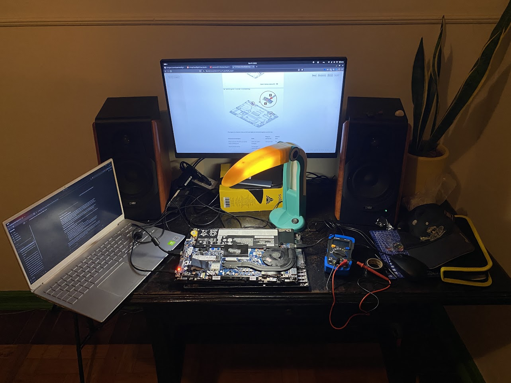
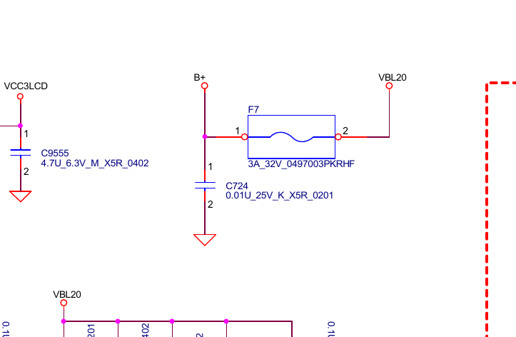
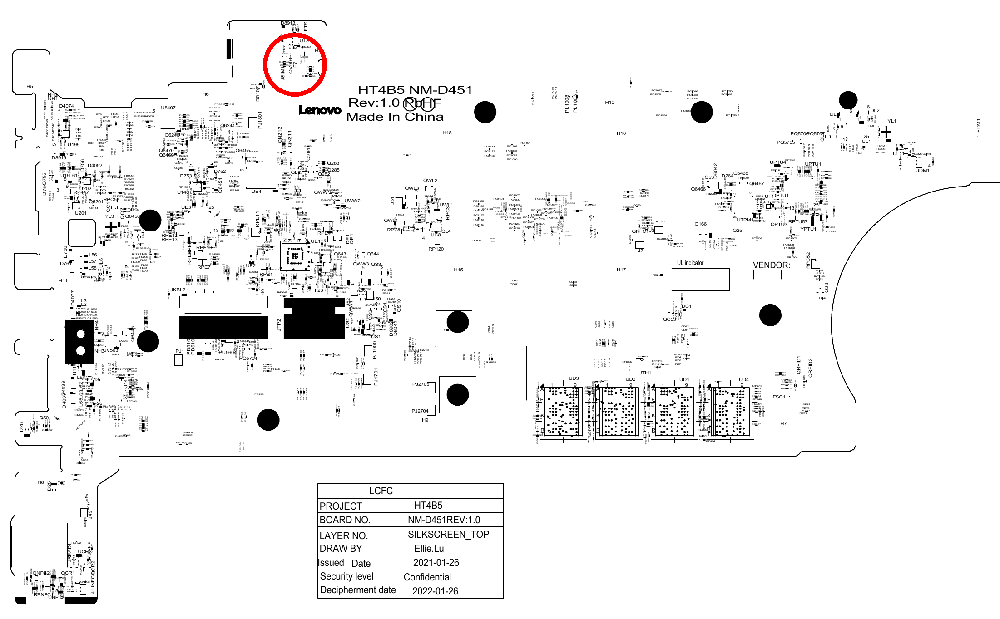
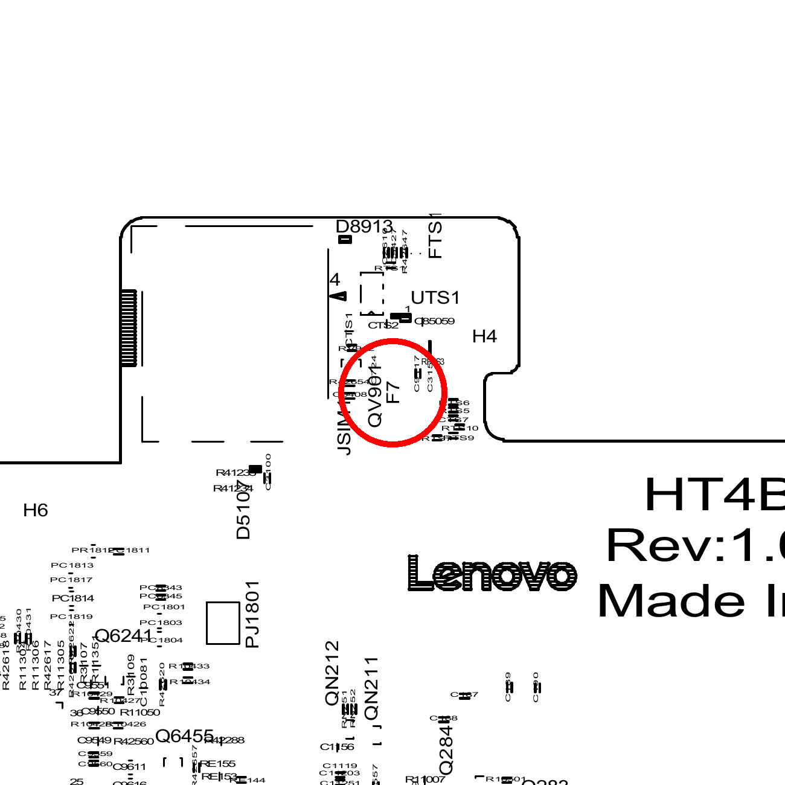
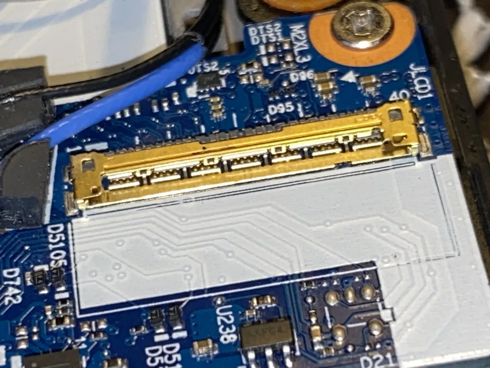
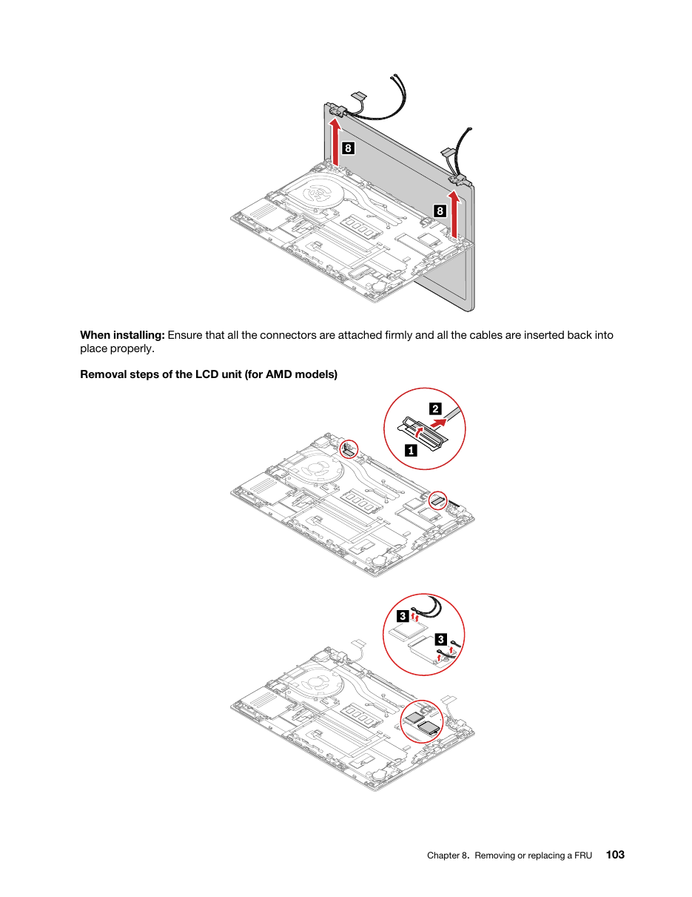
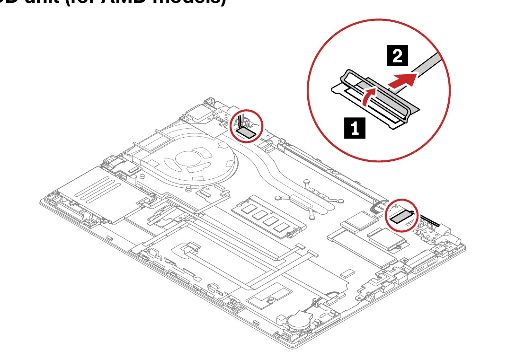
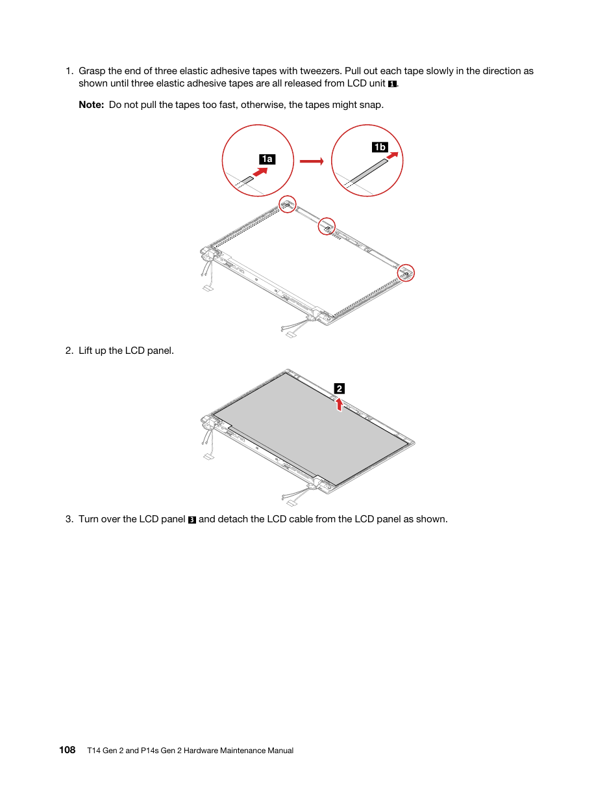
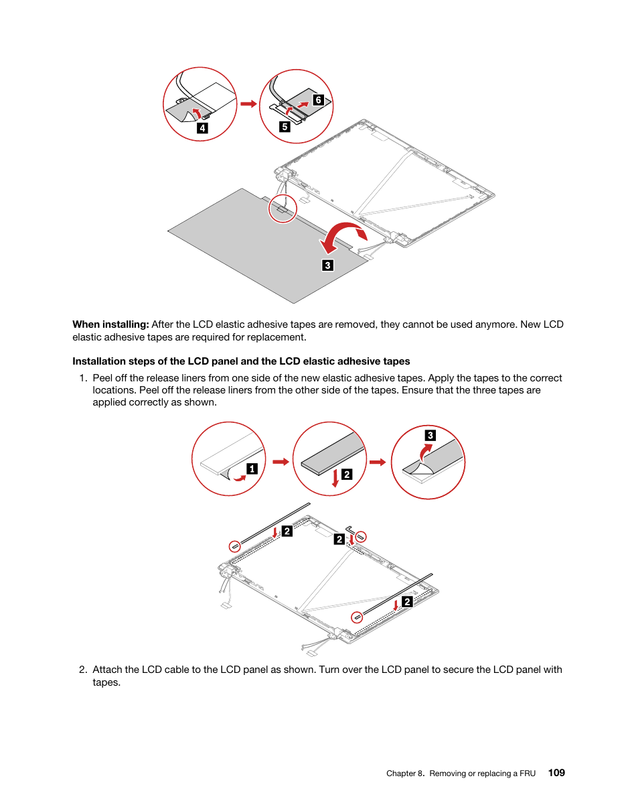
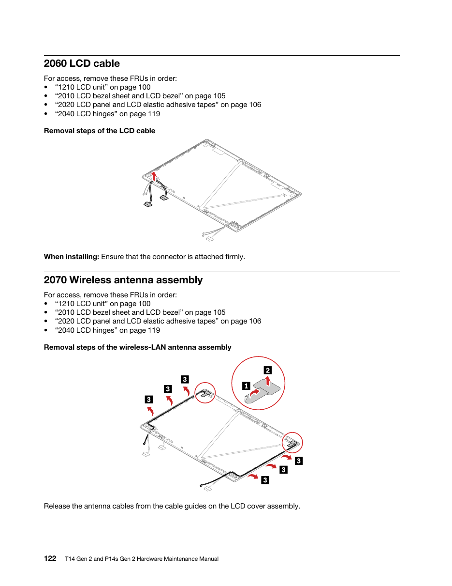

<DrawablePen :cloudStorage="true" penEmoji="🖉" strokeColor="blue" />

A step-by-step guide for finding why the internal panel of my ThinkPad T14 Gen 2a
(20XLS0CK00, AMD) went dark after I reopened the case. The page exists so I can
read it on my phone while the laptop is in pieces. The figures are from the
Lenovo Hardware Maintenance Manual (HMM) for the T14 Gen 2 and P14s Gen 2;
page numbers are the printed ones.

## What is already known

- The panel shows a faint desktop under a torch. The panel logic and the eDP
  data lanes work.
- The eDP link trained at 4 lanes, HBR2. `psr_state` is 0.
- The GPU commands the backlight at 99 % (`amdgpu_current_backlight_pwm`
  0xfb18, target equal).
- The lid switch reads open and the camera works, so the camera/Hall sensor/LED
  cable is fine.
- Reseating and cleaning the LCD cable at the system board did not help.

So the break is in the backlight supply path. Three candidates remained: the
LCD cable, the backlight fuse on the system board, the LED driver on the panel.
A multimeter separated them, see "Result" below.

## Result, 2026-09-24: the fuse F7 is open

Measured at the LCD connector JLCD1 on the board, panel connected, brightness
at maximum:

| Net     | JLCD1 pins | Measured | Meaning                      |
| ------- | ---------- | -------- | ---------------------------- |
| VCC3LCD | 19 to 21   | 3.33 V   | panel logic supply present   |
| BL_ON   | 34         | 3.3 V    | backlight enable present     |
| VBL20   | 37 to 39   | 0 V      | backlight power rail missing |

The cable has no short between VBL20 and ground. The NM-D451 schematic (sheet
"LCD/LID/MIC/CAMERA/PWR SW") shows VBL20 fed from B+ through one part only, the
fuse F7, Littelfuse 0497003, 3 A, 32 V, 0603. With BL_ON present and VBL20 at
0 V, F7 is the only part that can be open.

F7 sits on the keyboard side of the board, opposite JLCD1, on the corner tab
next to the SIM reader JSIM1, beside QV901 and UTS1, a few millimetres from the
"HT4B5 NM-D451 Rev:1.0" print. The board must come out to reach it.

To confirm, board out and unpowered: meter on beep, needles on the two metal
ends of F7. No beep means open. Then each end of F7 against a mounting-hole
ring: neither may beep, or a new fuse blows again.

Board removal note: the fan and heatsink are screwed to the board, so they come
out with it. The keyboard and touchpad cables are on the far side and are
reached only after the board is lifted and turned. Lift, flip, then disconnect.
I lifted without flipping and strained them. Do not do that.

Schematic and boardview: indiafix.in,
[NM-D451 rev 1.0](https://www.indiafix.in/2026/01/lenovo-thinkpad-t14-gen-2-nm-d451-rev.html),
RAR password "indiafix". The `.tvw` opens in OpenBoardView.

Panel from the EDID: CSOT `MNE001EA1-5`, 14" **UHD 3840x2160**, 40-pin eDP,
the 500-nit DisplayHDR option in the PSREF. The desktop runs at 1920x1080 only
because GNOME mirrors it with the HDMI monitor. This is not the common 30-pin
FHD panel, so the cable and the panel part numbers below are the UHD ones.

## The two connectors at the hinges

The figure is a bottom view, so left and right are mirrored against normal use.

| Connector in the figure                             | Cable                        | Hinge in normal use | Matters here |
| --------------------------------------------------- | ---------------------------- | ------------------- | ------------ |
| Wide, beside the WLAN card and the USB-C/HDMI ports | LCD cable (eDP + backlight)  | Left, port side     | Yes          |
| Narrow, beside the fan                              | Camera/Hall sensor/LED cable | Right, exhaust side | No           |

Both have a fold-up metal bar latch: lift the bar, pull the cable straight out,
push it back flat, fold the bar down.

## 40-pin panel connector: finding the backlight pins

The panel uses the 40-pin eDP connector. I do not have a verified pinout for
MNE001EA1-5, so find the pins on the panel PCB instead of counting:

- Pin 1 is marked with a "1" or a triangle. The backlight pins are the group at
  the opposite end of the connector.
- BL_VCC is a block of 3 to 5 adjacent pins joined by one wide copper trace,
  the widest trace on the connector. Expected with the machine on: a steady DC
  voltage, typically 7 to 21 V.
- BL_GND is the neighbouring block of pins joined by a wide trace to the ground
  plane. 0 V, meter ground.
- BL_EN and BL_PWM are two single thin-trace pins between those blocks and the
  data pins. Expected: about 3.3 V on BL_EN, 0 to 3.3 V on BL_PWM, changing
  with brightness.
- LCD_VCC is a pair of joined pins near the middle, next to the AUX pair.
  About 3.3 V. Use it as the sanity check: it must be present, because the
  panel shows an image.

If you want pin numbers, search "MNE001EA1-5 datasheet" or the panelook entry
for it and read the pin table there before probing.

## Battery rule

The internal battery must be disconnected for every unplug, plug, or continuity
check. It must be connected, with the machine running, for every voltage check.
The phases below alternate between the two.

To disconnect: shut the machine down, unplug the AC adapter, then pull the
internal battery plug straight off the system board. Pull on the plug, never on
the wires. Then hold the power button for 10 seconds to drain the board.

To connect: push the plug back on until it is flat and seated, then plug in the
AC adapter.

The base cover stays off from phase 1 to phase 5, so the connector is in reach
at every step.

## Phase 0, prepare

1. Meter on DC volts, 20 V range, for voltage. Beep or diode symbol for
   continuity.
2. Tape a sewing needle to each probe tip. The pins are 0.5 mm apart.
3. Shut the machine down.

## Phase 1, open, battery disconnected

4. Unplug the AC adapter.
5. Remove the base cover (HMM 1020, 5 captive screws, pry from the rear edge).
   Disconnect the internal battery (see above).
6. Remove the bezel. Lift at the four arrows. The bezel sheet is single use.

7. Pull the three stretch tapes slowly (step 1). Lift the panel out (step 2) and
   turn it face down onto a cloth on the keyboard (step 3). Leave the LCD cable
   connected at both ends.

8. On the back of the panel, find the 30-pin connector on the panel PCB and its
   pin 1 mark.

## Phase 2, voltage, machine on

9. Connect the internal battery. Plug in the AC adapter. Power on and boot to
   the desktop on the HDMI monitor. Press Fn+F6 until the brightness is at
   maximum.
10. Black needle on a BL_GND solder tail. Hold it there for every reading.
11. Sanity check: red needle on an LCD_VCC pin. Expect about 3.3 V. No reading
    means wrong pins or wrong end. Fix that before going on.
12. Red needle on each BL_VCC pin in turn. Write down each.
13. Red needle on BL_EN, then BL_PWM. Write down each.
14. Read the result:
    - BL_VCC shows 7 to 21 V and BL_EN about 3.3 V: the panel's LED driver is
      dead. Replace the panel. Stop.
    - BL_VCC shows 0 V: the power line does not reach the panel. Phase 3.
    - BL_VCC shows voltage, BL_EN 0 V: the enable line does not reach the
      panel. Phase 3, test BL_EN in particular.
15. Shut down. Do not let the probes touch anything else while the machine is
    on. A slip across two pins can damage the panel.

## Phase 3, cable continuity, battery disconnected

16. Shut down. Unplug the AC adapter. Disconnect the internal battery.
17. Unplug the cable at the panel: peel the tape, lift the latch, pull straight
    out (steps 4 to 6). Unplug it at the board: lift the bar latch, pull
    straight out.

18. Meter on continuity. One needle on a BL_VCC pin at the panel-end plug.
    Sweep the other needle across every pin of the board-end plug until it
    beeps. Note which pin. Repeat for the other BL_VCC pins and for BL_EN. The board end is Lenovo's own pinout,
    so finding the mate by sweeping is the method.
19. Short check: needle on a BL_VCC pin at the panel-end plug, other needle on
    a BL_GND pin at the same plug. It must not beep.
20. Read the result:
    - A pin from step 18 beeps nowhere: the cable is open. Replace the cable.
      Stop.
    - Step 19 beeps: the cable is shorted. That also explains a blown fuse.
      Replace the cable and do phase 4.
    - All beep correctly, no short: the cable is good. Phase 4.

Cable route inside the lid, for the visual check along the left hinge:

## Phase 4, fuse and board

21. Still off, battery disconnected. On the board next to the LCD connector, find
    the small rectangular part marked F and a number on the silkscreen.
    Continuity across its two ends.
    - No beep: the fuse is blown. Solder replacement on the board. Stop.
    - Beeps: the fuse is fine. Step 22.
22. Plug the cable back in at both ends. Connect the internal battery. Plug in
    the AC adapter, power on to the desktop, brightness to maximum.
23. On the board-side connector, measure the solder tail of the pin that mated
    with BL_VCC in step 18, against any ground.
    - 0 V: the board does not switch the backlight power on. Board-level fault.
    - Voltage present: the reseat in step 22 fixed the cable contact, or the
      panel fails intermittently. Check whether the panel is lit.

Caveat: some boards only switch the backlight rail on when a panel is detected.
A 0 V reading at the board end with the cable unplugged means nothing. Always
measure voltage with the cable connected at both ends.

## Phase 5, close

24. Shut down. Unplug the AC adapter and disconnect the internal battery before
    you plug and route the cable.
25. Fit the panel with thin double-sided tissue tape (0.1 to 0.25 mm, 2 to 3 mm
    wide, the phone repair kind, not foam) at the same places as the original
    stretch tapes: both short sides and the short strip at the top. Short
    strips at the corners are enough while the panel may still come out again.
26. Clip the bezel on. Connect the internal battery. Fit the base cover. Plug in
    the AC adapter.

## Parts, by fault

Part numbers and prices from a web search on 2026-09-15. Open each link to see
the live price and shipping to Brazil. Cheapest first.

### Cable (UHD, 40-pin)

| Item                                                      | Number                                   | Where                                                               | Price     |
| --------------------------------------------------------- | ---------------------------------------- | ------------------------------------------------------------------- | --------- |
| LCD cable, UHD 40-pin, T14 Gen 2 20XK/20XL and P14s Gen 2 | Lenovo FRU 5C10Z23933                    | [AliExpress](https://www.aliexpress.com/item/4000776558824.html)    | about $26 |
| Same family, FHD 30-pin, only with an FHD panel           | Lenovo FRU 5C10Z23930, cable DC02C00DY50 | [AliExpress](https://www.aliexpress.com/item/1005003425017477.html) | about $35 |

Source for the family: [myfixguide](https://www.myfixguide.com/store/lcd-cable-for-t14-gen2/),
"5C10Z23930 is specifically the 30-pin FHD (non-touch) cable, 5C10Z23931 is the
40-pin FHD Touch version, 5C10Z23932 is 40-pin FHD Touch Privacy, and
5C10Z23933 is the 40-pin UHD cable."

### Fuse

System board: Lenovo NM-D451, silkscreen HT4B5, FRU 5B21C82223 for the
Ryzen 7 PRO 5850U with 16 GB soldered
([Newegg listing](https://www.newegg.com/p/2RC-003M-00ZW7)). The backlight
fuse is F7, Littelfuse 0497003.PKRHF, 3 A 32 V fast acting, 0603, confirmed in
the schematic (see "Result" above). The earlier guess FV1 from sibling boards
was wrong. Any 3 A 32 V fast-acting 0603 chip fuse fits, for example Littelfuse
0494003 or 0467003.

Repair shops in Rio de Janeiro with board-level labs: Soluciomática (Centro,
Barra), FixTech (Méier, Barra), SpeedTech (Del Castilho, courier pickup), JR
Manutenção de Placa Mãe (Higienópolis). Estimate for a fuse swap: R$ 150 to
400 labour, plus a diagnostic fee of R$ 50 to 150 usually waived on approval.

| Item                                                              | Where                                                                         | Price            |
| ----------------------------------------------------------------- | ----------------------------------------------------------------------------- | ---------------- |
| SMD fuse kit, 0603 and 1206, 1 to 5 A, pick an assortment listing | [AliExpress search](https://www.aliexpress.com/w/wholesale-fuse-kit-smd.html) | $2 to $8 per 100 |

### Panel

| Item                                                               | Number                                                                                                | Where                                                                                                                                                 | Price             |
| ------------------------------------------------------------------ | ----------------------------------------------------------------------------------------------------- | ----------------------------------------------------------------------------------------------------------------------------------------------------- | ----------------- |
| Same panel, UHD 40-pin                                             | CSOT MNE001EA1-5 (also -1, -4)                                                                        | [eBay](https://www.ebay.com/itm/365104274747)                                                                                                         | about $150        |
| FHD 1080p downgrade, 30-pin, needs the 30-pin cable 5C10Z23930 too | Innolux N140HCG-GQ2, AUO B140HAN04.E, BOE NE140FHM-N61; Lenovo FRU 5D10W87245, 5D11C67446, 5D10W69523 | [AliExpress N140HCG-GQ2](https://www.aliexpress.us/item/3256805826418836.html), [combo listing](https://www.aliexpress.us/item/3256808509507570.html) | about $85 to $120 |

Both are tape mounted, no side brackets. Caveat on the downgrade: one iFixit
report of a UHD to FHD swap on this chassis ended in "It would not start at
all, even with the charger plugged in"
([iFixit](https://www.ifixit.com/Answers/View/951545)). Cable and panel must be
the same family, 30-pin with 30-pin, 40-pin with 40-pin.

## Tools

| Tool                                                   | Needed for               | Where                                                                                               | Price           |
| ------------------------------------------------------ | ------------------------ | --------------------------------------------------------------------------------------------------- | --------------- |
| Digital multimeter with continuity beep, DT-830 type   | all phases               | [AliExpress search](https://www.aliexpress.com/w/wholesale-dt830-digital-multimeter.html), or Saara | about $5 to $10 |
| Two sewing needles, taped to the probes                | all phases               | any haberdashery                                                                                    | cents           |
| PH0/PH00 precision screwdriver                         | base cover, hinges       | [AliExpress](https://www.aliexpress.com/item/32848169892.html)                                      | $6.88           |
| Plastic pry tool / spudger                             | base cover, bezel        | [AliExpress](https://www.aliexpress.com/item/32823627487.html)                                      | $1.99           |
| Thin double-sided tissue tape, 3M 9448 type, 2 to 4 mm | panel remount            | [AliExpress 4 mm x 50 m](https://www.aliexpress.com/item/1969970315.html), or Saara                 | $5.37           |
| Isopropyl alcohol, lint-free cloth                     | connectors, tape residue | pharmacy                                                                                            | cheap           |
| Temperature-controlled soldering iron, fine tip, flux  | fuse only                | [AliExpress search](https://www.aliexpress.com/w/wholesale-soldering-iron-kit.html)                 | $15 to $30      |

## Shopping list, Saara

- Thin double-sided tissue tape: "fita dupla face fina de tecido para tela de
  celular", 2 to 3 mm wide. Reference: 3M 9448 or 300LSE. Not "espuma", not VHB.
- Digital multimeter, DT-830 type.
- Two sewing needles for the probe tips.

## Video: the same fault on a Lenovo E14

South London Repair, "Lenovo E14 Display Repair No Backlight Engineer mistake,
sparks". A no-backlight case on a related Lenovo, with the board-side probing
shown on camera.

<iframe class="aspect-video" title="Lenovo E14 Display Repair No Backlight Engineer mistake, sparks | South London Repair" width="945" height="531" src="https://www.youtube.com/embed/I5T9uOPX6kQ?rel=0" allowfullscreen></iframe>

Link: <https://www.youtube.com/watch?v=I5T9uOPX6kQ>

## Sources

- Lenovo, T14 Gen 2 and P14s Gen 2 Hardware Maintenance Manual, printed pages
  39 (error 0288), 41 (LCD symptoms), 103, 105 to 109, 122.
- Panel and cable part numbers, board name, fuse threads and laptop prices:
  web search on 2026-09-15, links inline above.
- NM-D451 rev 1.0 schematic and boardview, indiafix.in, read on 2026-09-24.
  Cable label on this machine: HT4B0 UHD LCD CABLE EDP DC02C00L360.
- The full investigation log is not publised, `debugging.md`, appendix A15.
