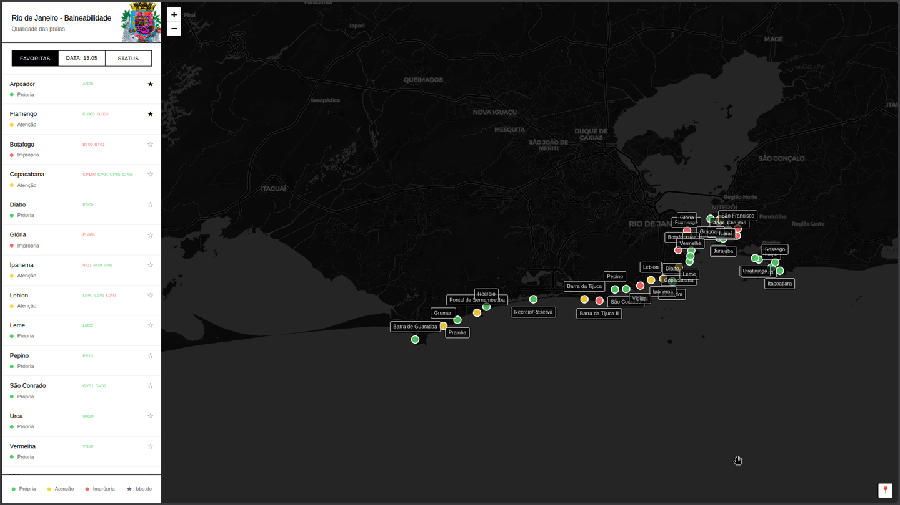
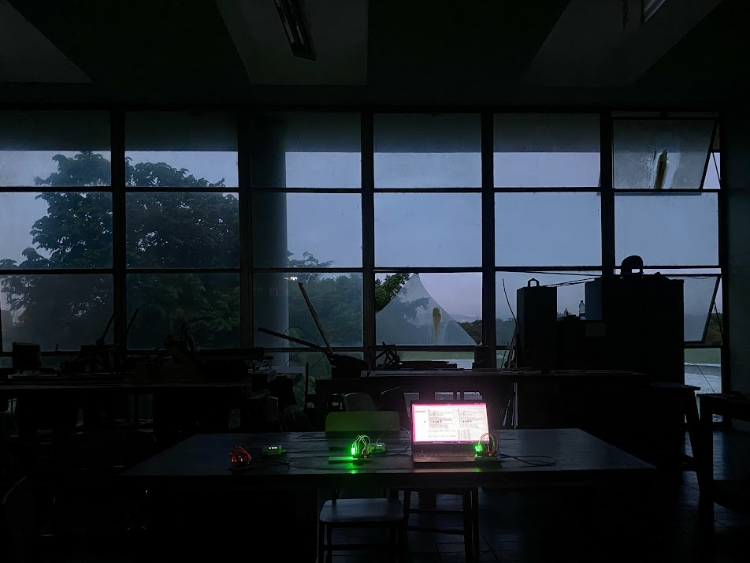

<script setup>
import DrawablePen from '../../src/components/DrawablePen.vue'
</script>

<div>
<DrawablePen :cloudStorage="true" penEmoji="🖉" />
<DrawablePen :cloudStorage="true" penEmoji="🖍️" strokeColor="red" :tipOffsetX="5" :tipOffsetY="43" />
<DrawablePen :cloudStorage="true" penEmoji="🖌️" strokeColor="rgba(0, 255, 255, 0.5)" :strokeWidth="25" :tipOffsetX="5" :tipOffsetY="43" />
<DrawablePen :cloudStorage="true" penEmoji="🧹" strokeColor="rgba(0,0,0,1)" :eraserMode="true" :strokeWidth="80" />
</div>

Esta página é minha proposta para o Open Lab do [Hiperorgânicos 13](https://www.even3.com.br/hiperorganicos-13-simposio-internacional-753706/), MAC Niterói, 10 a 14 de novembro de 2026. As canetas à esquerda são compartilhadas. Desenhe, deixe uma nota, diga o que acha!

O tema desta edição é **Acoplamentos Sutis: Comunidade, Pertencimento, Memória**. O texto curatorial fala de acoplamentos que "operam muitas vezes fora dos regimes dominantes de visibilidade". Esta proposta é uma bancada de trabalho para esses acoplamentos: entre pessoas e código, entre visitantes, e entre as câmeras que carregamos e as imagens que elas podem fazer juntas.

---

## Now You See Me (Agora Você Me Vê):

**um open lab sobre código generativo, ferramentas colaborativas e as câmeras entre nós.**


## Modalidade

Open Lab, três dias (10 a 12 de novembro), com uma oficina de Hydra de duas horas dentro dele. Se apenas um formato couber na programação, cada parte também funciona sozinha. Estou à vontade com as duas opções.

## Resumo

Now You See Me é um open lab no sentido literal: uma mesa no museu onde trabalho por três dias com as portas abertas, e onde qualquer pessoa pode sentar e trabalhar comigo. Trago três coisas da minha prática:

1. Exploração em todas as direções, criando pequenos artefatos para as ideias que surgem.
2. Pensamento e infraestrutura sobre como trabalhar com imagem e sensores na internet.
3. A capacidade de criar novas conexões a partir dos dispositivos e ideias que visitantes e artistas trazem.

A ideia é que as pessoas se sentem comigo, abram o laptop, tirem o celular do bolso, façam um pouco de OSINT e arquivem imagens. Encontrar sensores ao vivo, feeds de câmera, despejos de fotos. Podemos colocar tudo aqui no meu site, ou no seu. Você pode anotar e desenhar se não quiser programar, pode programar e publicar, pode fazer o que quiser.


O lab faz três perguntas que seguem o tema desta edição. Comunidade: o que um grupo consegue fazer quando as ferramentas de criação estão abertas e visíveis, em vez de escondidas num aplicativo ou numa sala de controle? Pertencimento: quem pode aparecer na imagem compartilhada, quem pode mudá-la, e quem decide? Memória: uma imagem que se realimenta lembra dos próprios quadros passados, um canvas compartilhado lembra de cada traço, uma câmera de vigilância nos lembra para outra pessoa. Quais dessas memórias queremos guardar, quem as guarda, e o que podemos fazer com elas?

Gosto de usar feeds de câmeras locais e dados abertos quando acessíveis, como fiz com os dados do INEA que eles publicam.



## Conceito e relação com o tema

O texto curatorial descreve uma crise das "formas de estar junto, de compartilhar o sensível e de produzir sentido coletivo", e nomeia a mediação das relações por sistemas técnicos como uma das causas. Eu programo para viver e faço arte com isso, então trabalho dentro do problema. A pergunta que atravessa minha prática é se um sistema técnico pode produzir o oposto: presença, atenção compartilhada, um pequeno comum. As ferramentas que trago são pequenas, abertas e visíveis. Sem login, sem feed, sem ranking. Tecnologia como mesa, não como plataforma. Venha repartir o pão.

### Código generativo como ofício compartilhado

Live coding é escrever o programa enquanto ele roda, na frente de quem vê o resultado. Um erro é visível. Um visitante pode apontar uma linha e perguntar o que ela faz, ou mudá-la. No lab, o [Hydra](https://hydra.ojack.xyz) roda no projetor o tempo todo e o código fica numa tela ao lado. Com modelos generativos de código, novas ideias podem ser prototipadas muito rápido. Um loop de realimentação leva o último quadro de volta para o próximo, então a imagem lembra o próprio passado e o transforma aos poucos: memória não como registro, mas como força ativa de transmissão e continuidade.

### Tecnologias colaborativas

Construo pequenas ferramentas para as pessoas fazerem coisas juntas na web. O canvas de desenho no topo desta página é uma delas: cada traço é compartilhado com todos que têm a página aberta, em tempo real, sem conta. O [bidi](https://bbo.do/projects/bidi) era um tradutor em que as traduções vêm de quem o usa, com piadas e erros incluídos; o suporte, infelizmente, expirou. O [rj-bd](https://bbo.do/rj-bd) transformou os boletins semanais de balneabilidade do INEA num mapa público de 25 praias do Rio, até ser bloqueado. Para a exposição [RESGUARDO, Tecnologias de Continuidade](https://bbo.do/projects/resguardo-tecnologias) de Rafa Mourão no Rio este ano, construí a eletrônica escondida que faz uma borboleta e três vaga-lumes, símbolos ancestrais de duas mulheres que fizeram história no Brasil, responderem ao visitante que se aproxima.



No lab essas ferramentas vivem no meu laptop e estão em uso. O canvas é projetado ao lado da saída do Hydra e alimenta essa saída, ou talvez alimente o próprio prédio do MAC.

### As câmeras entre nós

Toda sala de um museu tem câmeras. Todo visitante traz mais uma ou duas no bolso, na tampa do laptop, no pulso. Já estamos acoplados por câmeras que nos observam. O lab, idealmente, pega esses feeds, com permissão, e os transforma numa imagem compartilhada e visível, projetada de volta no espaço onde foi captada. Não quero fazer uma obra _sobre_ vigilância. Quero uma situação em que uma comunidade lida com sua própria vigilância por três dias e descobre para que ela serve. Mundos que se encontram sem se cancelar, como diz o texto curatorial.

Nem toda câmera do lab está na sala. Desde 2019 performo com feeds ao vivo de webcams públicas: uma praia no Rio, um porto no norte da Noruega, um vulcão na Sicília, um galinheiro. Nada acontece nelas. Um feed ao vivo não é o registro de outro lugar, é uma janela para a situação real de algum lugar. Quando a Praia de São Conrado é projetada em Niterói no exato momento em que a onda quebra, a sala e a praia compartilham um presente. Pertencimento aqui não está preso a um território. Ele se faz por uma visão compartilhada através da distância e um momento compartilhado no tempo. Uma webcam pública ainda é uma janela de mão única, então feeds distantes são sempre misturados com uma câmera da sala.

### O que acontece no lab

O prédio do MAC, a baía, a luz de Niterói, o fluxo de visitantes, as outras mesas do Open Lab: esses também são materiais. Trago ferramentas e um modo de trabalhar, e espero que os três dias tomem direções que não posso planejar aqui. O dia 1 é escuta: montagem, caminhar pelo prédio com uma câmera, primeiros esboços com o que os visitantes trouxerem. O dia 2 é acoplamento: desenhos do canvas alimentam a imagem, uma câmera do museu encontra um celular na mesa, as webcams da baía encontram a sala. O dia 3 é memória: os esboços são performados como uma sequência com som, visitantes assumem o código e o canvas, e no fim olhamos para o que fica.

## Oficina de Hydra

Uma sessão de duas horas sobre como usar o Hydra, para até 20 participantes. Não é preciso conhecimento prévio. O Hydra roda no navegador, nada precisa ser instalado, e duas pessoas podem dividir um laptop. Começamos de um único oscilador, adicionamos a câmera do próprio dispositivo como fonte, e terminamos com todos se revezando no projetor. Os participantes saem com uma página de código funcionando e links para rodá-lo depois. A sessão é em inglês, com apoio em português mesmo que limitado.

## Pedidos técnicos e o que eu trago

**Pedido ao MAC e ao NANO**

- Acesso a um ou mais feeds de câmera do museu durante o lab, como stream de rede ou captura HDMI. Se isso não for possível, basta uma câmera instalada pelo museu num lugar de sua escolha.
- Um projetor ou uma tela grande, e se possível uma projeção no espaço que a câmera observa.
- Uma mesa, duas cadeiras, energia, e uma conexão de internet que funcione.
- Para a oficina: espaço para 20 pessoas, o mesmo projetor, e wifi.

**O que eu trago**

- Um laptop e um celular!

**Esquema técnico**

```
         )))                     )))                    )))
   [ servidor NANO ]     [ webcams e outros servidores ] [ câmera do museu ]
          \                       |                       /
           \ wifi                 \ wifi                 / wifi
            \                      \                     /
             `----------------->  [ meu laptop ]  <-------'
                                 (Hydra + canvas compartilhado)
                                        |
                                        | cabo (HDMI / USB-C)
                                        v
                                  [ projetor ]
                                        |
                                        v
                              projetado na parede do MAC
```

Tudo roda por wifi, então o laptop pode falar diretamente com o servidor do NANO, além das webcams públicas e da câmera do museu, se isso for útil para a infraestrutura do evento.


**Alternativa caso os feeds do museu não estejam disponíveis**

O lab funciona com as câmeras que as pessoas trazem e com as webcams públicas do Rio que qualquer um pode abrir num navegador. Os outros dois eixos não dependem dos feeds do museu de forma nenhuma.

## Cuidado e consentimento

- As câmeras no lab são visíveis e identificadas. Um aviso explica a montagem.
- Nenhum quadro é gravado ou transmitido para fora da sala. O processamento é ao vivo e local.
- Não uso os feeds do museu para nada além do lab, e não mantenho acesso depois do dia 12 de novembro.
- O canvas compartilhado guarda o que as pessoas desenham, e qualquer um pode apagar. Nenhum nome ou conta é coletado.


## Biografia

Bodo Braegger faz hardware e software para pesquisa, indústria e arte. Sua prática visual se apoia em síntese de vídeo com live coding em Hydra, feeds ao vivo de webcams e câmeras de vigilância, imagens de satélite e imagens encontradas, performadas em eventos de música eletrônica em Zurique desde 2019 e no Rio de Janeiro desde 2026. Ele também constrói ferramentas para as pessoas desenharem, traduzirem e assistirem juntas na web.

Ele é aluno do mestrado em Estudos Transdisciplinares na Zürich University of the Arts (ZHdK), em intercâmbio na Escola de Belas Artes da UFRJ. Tem mestrado em Ciência da Computação pela ETH Zürich, onde trabalha no Decision Science Laboratory.

## Referências

- Xu Bing, _Dragonfly Eyes_ (2017). Um longa-metragem montado inteiramente a partir de imagens de vigilância encontradas online.
- [cickindunt](https://www.cickindunt.com/). Trabalho em vídeo construído a partir de câmeras e telas.
- Olivia Jack, [Hydra](https://hydra.ojack.xyz), e a comunidade de live coding em torno do [TOPLAP](https://toplap.org).
- Manu Luksch, _Faceless_ (2007) e o _Manifesto for CCTV Filmmakers_.
- Jill Magid, _Evidence Locker_ (2004).
- Julia Scher, _Security by Julia_.
- Hito Steyerl, _How Not to Be Seen_ (2013).
- Ai Weiwei, _WeiweiCam_ (2012).
- !Mediengruppe Bitnik, _CCTV, A Trail of Images_.
- Roberta Carvalho, [robertacarvalho.art.br](https://www.robertacarvalho.art.br/).
- Rafa Mourão, _RESGUARDO, Tecnologias de Continuidade_ (Rio de Janeiro, 2026).

---

## Esboços

Esboços de trabalho na direção do lab. Nesta página eles rodam ao vivo. Clique num bloco se ele não iniciar sozinho. Os dois primeiros pedem sua câmera. Seu dispositivo tem uma. Esse é o ponto.

```javascript
// now you see me: sua própria câmera, lembrada pelo quadro anterior
s0.initCam()
src(s0)
  .saturate(2)
  .contrast(1.3)
  .layer(src(o0).mask(shape(20, 3).scale(0.3, 0.5).scrollX(0.001)).scrollX(0.001))
  .modulate(o0, 0.003)
  .out(o0)
```

```javascript
// duas câmeras, acopladas: o feed contra seu próprio passado pixelizado
s0.initCam()
src(s0)
  .repeatX(-1)
  .invert()
  .contrast(2)
  .modulateScale(src(s0).repeatX(-1).pixelate(100, 1), -0.5)
  .saturate(0)
  .invert()
  .brightness(0.2)
  .out(o0)
```

```javascript
// o esboço do lab, sem câmera aqui
bpm = 120
osc(10, 0, 3)
  .colorama()
  .diff(shape([4, 3, 1.2, 99, 99, 99, 99], [0.1, 0.8]).color(1, 0, 0))
  .pixelate([30, 40, 50, 300, 300], [20, 300, 2000])
  .modulate(voronoi())
  .modulate(src(o0))
  .blend(o0, 0.4)
  .color(
    () => Math.sin(time / 17),
    () => Math.tan(time / 13),
    () => Math.cos(time / 19),
  )
  .scale(1, innerHeight / innerWidth)
  .out()
```

## Mais

Mais esboços de Hydra, incluindo exemplos com câmera e reativos a áudio, estão na página de [exemplos de live coding](/notes/2025-04-26_livecoding_examples). A ferramenta de desenho compartilhado está documentada em [drawing board](/projects/drawing-board). As duas sessões que dei na disciplina de Arte Digital de Cila MacDowell na EBA estão documentadas [aqui](/notes/2026-04-08_arte_digital_portfolio_talk) e [aqui](/notes/2026-05-14_arte_digital_canvas).
