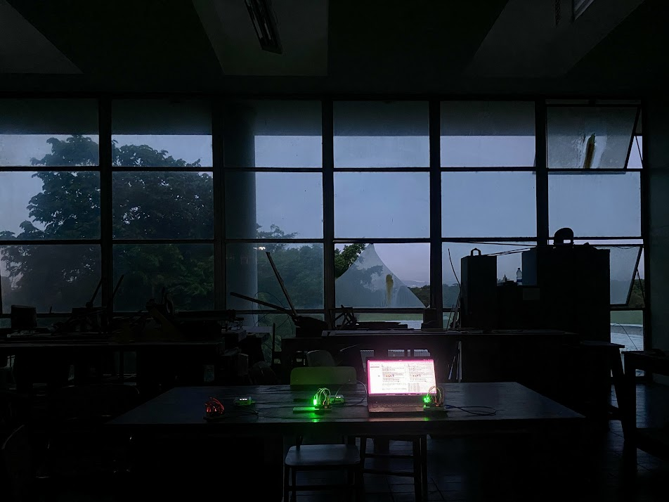
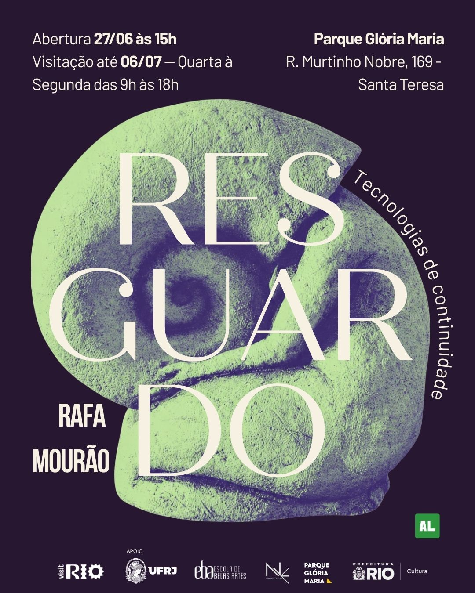

## About

Electronics and firmware for the interactive sensor modules in Rafa Mourão's solo exhibition **RESGUARDO - Tecnologias de Continuidade**, Rio de Janeiro, June 2026.

The exhibition features four independent Arduino Nano units hidden inside artwork pieces, each powered by a portable power bank. Three pieces use PWM-faded LEDs triggered by an HC-SR04 ultrasonic proximity sensor - each with a distinct concept and timing (slow attraction pulse, accelerating heartbeat, meditative breathing loop). A fourth piece plays audio via a DFPlayer Mini when someone approaches. Thematically centered around:

> [...] insects - a butterfly and three fireflies - that guide the visitor through the tunnel. The insects are ancestral symbols of two women who made history in Brazil and left a legacy of how to survive amidst gender, race, and class adversities.

## Technical Details

Each unit runs independent firmware, compiled and flashed with arduino-cli. The LED pieces use PWM on a single pin driving multiple LEDs in parallel through individual current-limiting resistors. The audio piece sequences three tracks using the DFPlayer's BUSY pin to detect playback state.

The source code and full build documentation are available on GitHub:

- https://github.com/bodobraegger/resguardo-tecnologias
